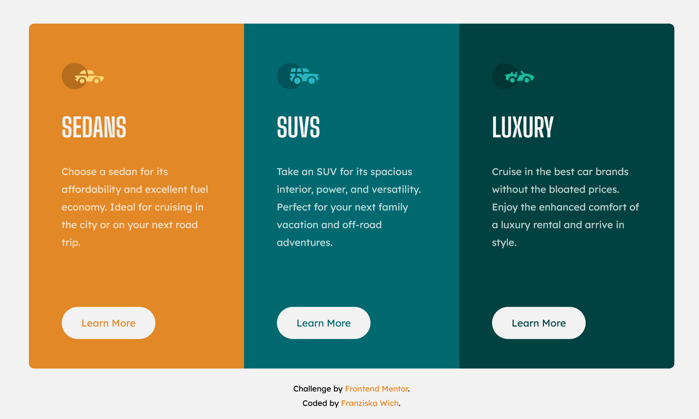

# Frontend Mentor - 3-column preview card component

This is a solution to the [3-column preview card component challenge on Frontend Mentor](https://www.frontendmentor.io/challenges/3column-preview-card-component-pH92eAR2-). Frontend Mentor challenges help you improve your coding skills by building realistic projects. 

## Table of contents

- [Overview](#overview)
  - [The challenge](#the-challenge)
  - [Screenshot](#screenshot)
  - [Links](#links)
- [My process](#my-process)
  - [Built with](#built-with)
  - [What I learned](#what-i-learned)
  - [Continued development](#continued-development)
  - [Useful resources](#useful-resources)
- [Author](#author)


## Overview

### The challenge

Users should be able to:

- View the optimal layout depending on their device's screen size
- See hover states for interactive elements

### Screenshot



### Links

- Solution URL: [https://github.com/franziskawich/3-column-preview-card-component/](https://github.com/franziskawich/3-column-preview-card-component/)
- Live Site URL: [https://franziskawich.github.io/3-column-preview-card-component/](https://franziskawich.github.io/3-column-preview-card-component/)


## My process

### Built with

- Semantic HTML5 markup
- SCSS (saved as CSS)
- Flexbox
- Mobile-first workflow
- BEM methodology

### What I learned

I learned that it is possible to create a media query with two breakpoints:

```css
@media only screen and (min-width: 28.1em) and (max-width: 56.5em) {
  .card__heading {
    display: inline;
    margin-left: 1rem;
  }
```

I have found out that the vertical-align property can have the value text-bottom, which was very helpful for aligning the icons next to my headings the way I wanted them. I used the ch unit for the first time and will probably use it again as it seems to be quite practical for some situations.

I had the problem that my attribution was right next to my content but I wanted it to be on the next row. Flex-wrap and a flex-basis of 100% for my content solved the problem. 

```css
{
  display: flex;
  flex: 0 0 100%;
  }
```

### Continued development

After uploading my solution I suddenly saw that when I zoom out in the browser to 80% that my attribution will jump to the first row again. This should not happen. I will check for something like this more thoroughly in the future.

### Useful resources

- [MDN: Vertical-align](https://developer.mozilla.org/en-US/docs/Web/CSS/vertical-align) - This helped me with the alignment of my icons to my headings.


## Author

- Frontend Mentor - [@franziskawich](https://www.frontendmentor.io/profile/franziskawich)
- freeCodeCamp - [Franziska Wich](https://www.freecodecamp.org/fcc35fab9df-6b8c-445e-8aec-36ee00e99ba0)
